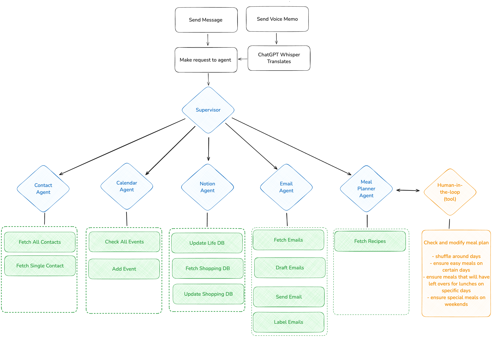

# Multi-agent home assistant based on LangGraph

This home assistant is an AI-powered system designed to automate and manage household planning tasks. It integrates **Notion**, **Google Calendar**, **Google Sheets** to handle scheduling, email, shopping lists, TODO-lists, note-taking and meal planning - all through a natural language interface.


The app is built with a simple multi-agent setup using LangGraph. Below is a walkthrough of how to get it up and running as well as how to extend and customize it with new agents and tools.


## Overview

### External services

We use different external services to manage various aspects of household planning:

**Notion**
* shopping list
* mind base: todo-list, ideas and general notetaking

**Google**
* email
* multiple calendars
* a google sheet with recipes + ingredients
* a google sheet with names and emails

### App structure

The app consists of the following agents:
* **supervisor** : receives user queries and routs to relevant sub-agents
* **calendar agent**: handles Google calendar interactions
* **notion agent**: handles Notion interactions
* **email agent**: handles Gmail interactions
* **meal planner agent**: creates meal plans based on the recipes list, interacts with user to get feedback and iterate until user is happy
* **contact agent**: handles Google sheets interactions





### Example usages

* "Add apples, oranges and tea to the shopping list"
* "Get all calendar events for the coming week and summarize the week for me"
* "Make a 2-week meal plan, add the meals as full-day events to the family calendar, starting March 1st, and add all ingredients to the shopping list"


### Interface

The app can be plugged into any communication method (e.g. a chatbot, voice assistant, or web app). In our setup, we interact with it through Telegram voice messages (though this interface is not covered in this README - reach out if you're interested to know more!).


# Setup

## Python

python 3.11 or higher

## Virtual Env

```bash
python -m venv venv
source venv/bin/activate
```

## App dependencies
```bash
pip install -r requirements.txt`
```

## Populate the .env file with credentials and app settings

Make a new `.env` file OR replace `.env.example`, fill in your credentials and add-specific details:

### Langsmith
* not necessary to specify in general, but very useful for tracing and troubleshooting
* necessary if launching local LangGraph server to use LangGraph Studio Web UI (see options to run below)

### Notion 

* Check the instructions for how to get a Notion API Key [here](https://developers.notion.com/docs/create-a-notion-integration) 
* IDs of individual pages are visible in the URL in the browser (the format seems to vary a bit, it should be a 32-character string)

### Google

* Google calendar IDs can be obtained from the calendar settings on Google

* Google sheet IDs can be obtained from the URL, field GOOGLE_SHEET_ID in the following format: 
https://docs.google.com/spreadsheets/d/GOOGLE_SHEET_ID/edit#gid=SHEET_ID

> **_NOTE:_**  Currently, a simple recipes "data base" setup using Google sheets is implemented. To have the meal planner agent access your own list of recipes, add a sheet called `recipes_db` to your main google sheet `RECIPES_GOOGLE_SHEET`. The sheet should have 2 columns, titled `name, ingredients`.


## Set up Google authentication

Please see the additional `README.md` in `/helper_scripts/README.md`

# Run in terminal

1. Modify the initial message to send as input data to the graph in main.py 
2.  `python main.py `


> **_NOTE:_**  The human-in-the-loop functionality of the meal planner agent uses interrupts, and this is a bit tricky to use when interacting with the graph through `graph.stream` in `main.py `. You can get some pointers e.g. [here](https://langchain-ai.github.io/langgraph/concepts/human_in_the_loop/#interrupt) if you want to try, but it's recommended to run graphs with this agent via LangGraph Studio Web UI, which takes care of the interrupts and resumes for you.

# Launching local LangGraph server (to use LangGraph Studio Web UI to run)

Following https://langchain-ai.github.io/langgraph/tutorials/langgraph-platform/local-server/ 

1. Make a langsmith account
2. `pip install --upgrade "langgraph-cli[inmem]"`
3. `cd langgraph_home_assistant/`
4. `langgraph dev`


# Launching local LangGraph server using self-hosted lite (to use the API to run)

Following https://langchain-ai.github.io/langgraph/how-tos/deploy-self-hosted/#environment-variables

1. `pip install -U langgraph-cli`
2. `langgraph build -t my-image`
3. Set up redis
4. Set up postgres
5. `docker run \
    --env-file .env \
    -p 8123:8000 \
    -e REDIS_URI="foo" \
    -e DATABASE_URI="bar" \
    -e LANGSMITH_API_KEY="baz" \
    my-image`


# Modifying the application

## Updating agent prompts or LLM models

The file `app_config.yaml` contains the config for all agents, except the supervisor which is defined in `agents/supervisor.py`.

Agent prompts and LLM models can be updated in these. Currently, the agents are built using [ChatOpenAI](https://python.langchain.com/docs/integrations/chat/openai/), meaning models including "gpt-3.5-turbo", "gpt-4o-mini","gpt-4o", etc can be specified. 

## Adding a tool

1. Write the code for the tool in the corresponding agent's file in `tools/`
2. Add the tool function to `tools/tools_registry.py`
3. Add the tool's description to the agent's config, section **tools**, using the same syntax as existing entries

## Adding an agent

### If adding an agent based on the LangGraph prebuilt component [ReAct agent](https://langchain-ai.github.io/langgraph/how-tos/create-react-agent/)

1. Add the agent definition to `app_config.yaml` (this will build the agent using the functionality in `utils/react_agent_factory.py`)
2. Update prompt, model and add tools as described in sections above
3. Update `agents_config.yaml` to include the new agent

### If adding a custom agent 

1. Add custom agent definition file to `agents/` (e.g. like the supervisor agent in `agents/supervisor.py`)
2. Add an import of the agent node to `main.py`
3. Add the agent node to the graph in `main.py`
